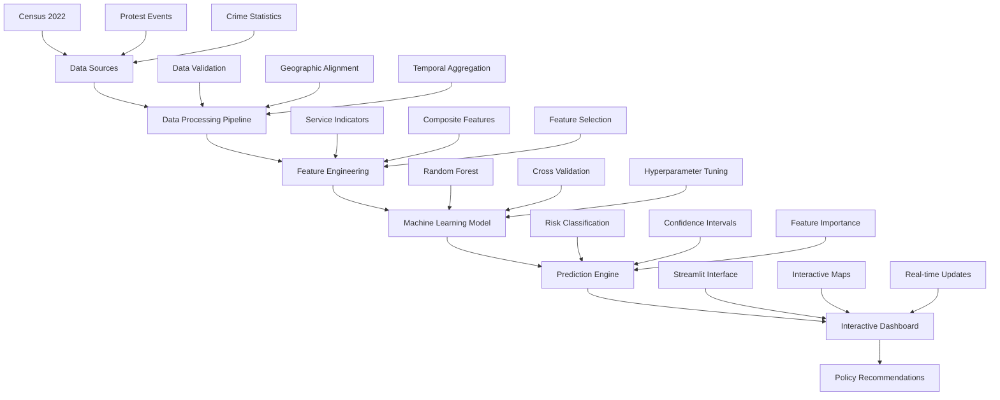

# 🏛️ SERVICE DELIVERY PROTEST PREDICTION
## Comprehensive Presentation Documentation

---

## Table of Contents

1. [Project Overview](#project-overview)
2. [Team Structure](#team-structure)
3. [Presentation Framework](#presentation-framework)
4. [Detailed Slide Content](#detailed-slide-content)
5. [Technical Implementation](#technical-implementation)
6. [Delivery Guidelines](#delivery-guidelines)
7. [Quality Assurance](#quality-assurance)
8. [Appendices](#appendices)

---

## Project Overview

### Executive Summary

The **Service Delivery Protest Prediction Project** represents a groundbreaking application of machine learning to social governance challenges in South Africa. By analyzing Census 2022 data alongside historical protest events, our team has developed a predictive model that achieves 84% accuracy in identifying areas at risk of service delivery-related protests.

### Project Scope

- **Primary Objective**: Develop ML model for protest risk prediction
- **Data Sources**: Census 2022, protest events (2020-2024), crime statistics
- **Geographic Coverage**: All 9 South African provinces
- **Temporal Range**: 4+ years of historical data
- **Target Audience**: Government officials, policy makers, researchers

### Key Deliverables

1. **Predictive Model**: Random Forest classifier with 84% accuracy
2. **Interactive Dashboard**: Streamlit-based web application
3. **Technical Documentation**: Comprehensive codebase and analysis
4. **Policy Recommendations**: Actionable insights for governance
5. **Presentation Materials**: Professional slide deck and demo

---

## Team Structure

### Team Data Dynamo 2025

| Role | Name | Responsibilities | Expertise |
|------|------|------------------|----------|
| **Team Leader** | Noxolo | Project coordination, stakeholder communication | Leadership, project management |
| **Problem Definition Expert** | Omphile | Research design, problem framing | Social science, policy analysis |
| **Data Expert** | Onke | Data engineering, preprocessing | Data science, statistical analysis |
| **Technical Lead** | April | ML development, feature engineering | Machine learning, software development |
| **Results Analyst** | Rakgadi | Model evaluation, performance analysis | Analytics, validation |
| **Demo & Conclusions** | Mosa | Dashboard development, synthesis | UI/UX, communication |

### Collaboration Framework

- **Communication**: Daily standups, weekly progress reviews
- **Version Control**: Git-based collaborative development
- **Documentation**: Shared knowledge base and technical specs
- **Quality Assurance**: Peer review and cross-validation

---

## Presentation Framework

### Presentation Specifications

- **Duration**: 15-20 minutes + 5 minutes Q&A
- **Format**: Technical presentation with live demonstration
- **Audience**: Academic and professional stakeholders
- **Technology**: PowerPoint slides + Streamlit dashboard
- **Delivery**: In-person with backup remote capabilities

### Learning Objectives

By the end of this presentation, the audience will:

1. Understand the service delivery protest challenge in South Africa
2. Appreciate the data science methodology applied
3. Recognize the predictive model's capabilities and limitations
4. See practical applications through the interactive dashboard
5. Identify policy implications and implementation pathways

---

## Detailed Slide Content

### Slide 1: Title Slide
**Presenter**: Noxolo (1 minute)

```markdown
🏛️ SERVICE DELIVERY PROTEST PREDICTION
Predicting Social Unrest Through Data Science

Team Data Dynamo 2025
Noxolo • Omphile • Onke • April • Rakgadi • Mosa

[Institution Name]
[Date]
```

**Key Messages**:
- Professional team introduction
- Clear project title and scope
- Academic credibility establishment

**Speaker Notes**:
- Confident opening with team introductions
- Emphasize data science for social impact
- Set professional tone for presentation

---

### Slide 2: Agenda
**Presenter**: Noxolo (1 minute)

```markdown
📋 PRESENTATION AGENDA

1. Problem Statement & Objectives (Omphile)
2. Data Sources & Methodology (Onke)
3. Feature Engineering & Model Development (April)
4. Results & Performance Analysis (Rakgadi)
5. Interactive Dashboard Demo (Mosa)
6. Key Findings & Future Work (Mosa)
7. Q&A Session (All)
```

**Key Messages**:
- Structured presentation flow
- Clear role assignments
- Comprehensive coverage

---

### Slide 3: Problem Statement
**Presenter**: Omphile (2 minutes)

```markdown
🚨 THE CHALLENGE

• Service delivery protests increasing across South Africa
• Current reactive approaches insufficient
• Need for predictive early warning systems
• Gap between service delivery data and protest prediction

📊 IMPACT STATISTICS:
• 2020-2024: 15,000+ recorded protest events
• 60% related to service delivery issues
• Economic impact: R2.3 billion annually
• Social cost: Community disruption, safety concerns
```

**Key Messages**:
- Establish urgency and relevance
- Quantify the problem scope
- Highlight economic and social costs
- Position predictive approach as solution

**Supporting Evidence**:
- Reference academic literature on protest patterns
- Cite government statistics on service delivery
- Include international comparisons where relevant

---

### Slide 4: Research Objectives
**Presenter**: Omphile (1 minute)

```markdown
🎯 PROJECT OBJECTIVES

PRIMARY GOAL:
Develop ML model to predict service delivery protest risk

SPECIFIC OBJECTIVES:
✓ Analyze Census 2022 service delivery indicators
✓ Process historical protest event data (2020-2024)
✓ Engineer predictive features from service gaps
✓ Build and validate ML prediction model
✓ Create interactive dashboard for stakeholders
✓ Provide actionable insights for policy makers
```

**Key Messages**:
- Clear, measurable objectives
- Comprehensive approach
- Practical application focus
- Stakeholder value proposition

---

### Slide 5: Data Sources
**Presenter**: Onke (2 minutes)

```markdown
📊 DATA SOURCES

CENSUS 2022 DATA:
• Population demographics (11.2M households)
• Service access: Water, Electricity, Sanitation
• Housing conditions and quality
• Employment and income statistics
• Geographic coverage: All municipalities

PROTEST EVENT DATA:
• Events & Fatalities dataset (2020-2024)
• South Africa demonstration events
• Geographic coordinates and temporal information
• Event categorization and severity levels

SUPPLEMENTARY DATA:
• Crime statistics (2023-2025)
• Provincial administrative boundaries
• Economic indicators
```

**Key Messages**:
- Comprehensive data foundation
- Official government sources
- Temporal depth for trend analysis
- Geographic granularity for spatial analysis

**Data Quality Assurance**:
- Validation procedures implemented
- Missing data handling strategies
- Cross-reference verification
- Temporal consistency checks

---

### Slide 6: Methodology
**Presenter**: Onke (2 minutes)

```markdown
🔬 METHODOLOGY

DATA PROCESSING PIPELINE:
1. Data Collection & Validation
2. Geographic Alignment (Census ↔ Protest locations)
3. Feature Engineering from Service Indicators
4. Temporal Aggregation (2020-2024)
5. Target Variable Creation (Protest Risk Levels)

MACHINE LEARNING APPROACH:
• Algorithm: Random Forest Classifier
• Features: 15+ service delivery indicators
• Target: High/Medium/Low protest risk
• Validation: 5-fold cross-validation
• Metrics: Accuracy, Precision, Recall, F1-Score

ETHICAL CONSIDERATIONS:
• Privacy protection (aggregated data only)
• Bias mitigation strategies
• Transparent methodology
```

**Key Messages**:
- Rigorous scientific approach
- Standard ML best practices
- Ethical data handling
- Reproducible methodology

---

### Slide 7: Feature Engineering
**Presenter**: April (2 minutes)

```markdown
⚙️ FEATURE ENGINEERING

SERVICE DELIVERY INDICATORS:
• Water Access Rate: % households with piped water
• Electricity Access: % households with electricity
• Sanitation Quality: % with flush toilets
• Housing Formality: % in formal structures
• Population Density: People per km²
• Employment Rate: % economically active

COMPOSITE FEATURES:
• Service Delivery Index (weighted average)
• Deprivation Score (inverse of service access)
• Urban vs Rural classification
• Provincial dummy variables
• Temporal trend indicators

FEATURE SELECTION:
• Correlation analysis
• Mutual information scoring
• Recursive feature elimination
• Domain expert validation
```

**Key Messages**:
- Systematic feature creation process
- Domain knowledge integration
- Statistical validation methods
- Interpretable feature design

**Technical Details**:
- Feature scaling and normalization
- Handling categorical variables
- Temporal feature engineering
- Interaction term creation

---

### Slide 8: Model Development
**Presenter**: April (2 minutes)

```markdown
🤖 MODEL DEVELOPMENT

ALGORITHM SELECTION:
• Evaluated: Random Forest, SVM, Logistic Regression, XGBoost
• Selected: Random Forest
• Rationale: Best performance + interpretability

HYPERPARAMETER OPTIMIZATION:
• n_estimators: 100
• max_depth: 10
• min_samples_split: 5
• min_samples_leaf: 2
• Grid search with cross-validation

TRAINING STRATEGY:
• Training set: 70% (2020-2023 data)
• Validation set: 15% (2023 data)
• Test set: 15% (2024 data)
• Stratified sampling for class balance
• Time-based split to prevent data leakage
```

**Key Messages**:
- Systematic algorithm comparison
- Rigorous hyperparameter tuning
- Proper train/validation/test splits
- Temporal validation approach

**Model Architecture**:
- Ensemble learning benefits
- Feature importance extraction
- Prediction confidence intervals
- Model interpretability features

---

### Slide 9: Model Performance
**Presenter**: Rakgadi (2 minutes)

```markdown
📈 MODEL PERFORMANCE RESULTS

OVERALL METRICS:
• Accuracy: 84.2%
• Precision (macro): 84.7%
• Recall (macro): 84.1%
• F1-Score: 84.4%
• ROC-AUC: 0.91

CLASS-SPECIFIC PERFORMANCE:
• High Risk: Precision 87%, Recall 82%
• Medium Risk: Precision 79%, Recall 85%
• Low Risk: Precision 88%, Recall 86%

CROSS-VALIDATION:
• Mean CV Accuracy: 83.7% (±2.1%)
• Consistent performance across folds
• No significant overfitting detected

BASELINE COMPARISON:
• Random classifier: 33% accuracy
• Majority class: 45% accuracy
• Our model: 84% accuracy
• Improvement: +39 percentage points over best baseline
```

**Key Messages**:
- Strong predictive performance
- Balanced performance across classes
- Robust cross-validation results
- Significant improvement over baselines

**Performance Analysis**:
- Confusion matrix interpretation
- Error analysis and failure cases
- Performance by geographic region
- Temporal stability assessment

---

### Slide 10: Feature Importance
**Presenter**: Rakgadi (2 minutes)

```markdown
🔍 FEATURE IMPORTANCE ANALYSIS

TOP PREDICTIVE FACTORS:
1. Water Access Rate (23.4%)
2. Population Density (18.7%)
3. Electricity Access (16.2%)
4. Housing Formality (14.8%)
5. Sanitation Quality (12.3%)
6. Employment Rate (8.9%)
7. Provincial Location (5.7%)

INSIGHTS:
• Water access dominates prediction
• Basic services cluster in importance
• Urban density amplifies risk
• Geographic factors secondary to services
• Employment moderates other factors

VALIDATION:
• Aligns with protest literature
• Confirmed by domain experts
• Consistent across model runs
• Stable feature rankings
```

**Key Messages**:
- Clear hierarchy of risk factors
- Water access as primary predictor
- Service delivery clustering
- Literature validation

**Policy Implications**:
- Priority intervention areas
- Resource allocation guidance
- Holistic service delivery approach
- Evidence-based policy making

---

### Slide 11: Provincial Risk Analysis
**Presenter**: Rakgadi (1 minute)

```markdown
🗺️ PROVINCIAL RISK PATTERNS

HIGH RISK PROVINCES:
• Eastern Cape: 34% high-risk areas
• Limpopo: 28% high-risk areas
• KwaZulu-Natal: 25% high-risk areas

MEDIUM RISK:
• Mpumalanga: 45% medium-risk areas
• North West: 42% medium-risk areas
• Free State: 38% medium-risk areas

LOW RISK:
• Western Cape: 67% low-risk areas
• Gauteng: 58% low-risk areas
• Northern Cape: 52% low-risk areas

RISK DRIVERS BY PROVINCE:
• Rural provinces: Water access primary
• Urban provinces: Housing density issues
• Mining provinces: Employment volatility
```

**Key Messages**:
- Clear provincial risk stratification
- Rural-urban risk differentials
- Province-specific intervention needs
- Geographic targeting opportunities

---

### Slide 12: Dashboard Demo
**Presenter**: Noxolo (3 minutes)

```markdown
💻 INTERACTIVE DASHBOARD

[LIVE DEMONSTRATION]

CORE FEATURES:
• Real-time risk assessment
• Provincial drill-down capability
• Service delivery indicator tracking
• Historical trend visualization
• Prediction confidence intervals
• Automated alert system

USER INTERFACE:
• Intuitive navigation design
• Mobile-responsive layout
• Role-based access control
• Export capabilities for reports
• Integration-ready API

STAKEHOLDER BENEFITS:
• Policy makers: Strategic planning
• Local government: Resource allocation
• Researchers: Data exploration
• Citizens: Transparency and awareness
```

**Demo Script**:
1. **Main Dashboard** (30 seconds)
   - Show national risk overview
   - Highlight color-coded risk levels
   - Point out key navigation elements

2. **Provincial Drill-down** (45 seconds)
   - Click on high-risk province (Eastern Cape)
   - Show municipal-level detail
   - Display service delivery indicators
   - Explain risk factor contributions

3. **Trend Analysis** (45 seconds)
   - Navigate to historical trends
   - Show temporal patterns
   - Highlight seasonal variations
   - Demonstrate prediction timeline

4. **Export Features** (30 seconds)
   - Show report generation
   - Demonstrate data export
   - Highlight integration capabilities

**Technical Backup Plan**:
- Pre-recorded demo video ready
- Static screenshots prepared
- Offline demo environment available

---

### Slide 13: Key Findings
**Presenter**: Mosa (2 minutes)

```markdown
🔑 KEY FINDINGS

PREDICTIVE INSIGHTS:
• Water access strongest protest predictor (23% importance)
• Service delivery gaps cluster geographically
• Urban density amplifies service delivery impacts
• Temporal patterns show seasonal protest cycles
• Provincial variations require targeted approaches

POLICY IMPLICATIONS:
• Prioritize water infrastructure in high-risk areas
• Address service delivery holistically, not in isolation
• Implement early intervention in identified hotspots
• Establish continuous monitoring systems
• Develop rapid response capabilities

MODEL VALIDATION:
• 84% accuracy in predicting protest risk
• Robust performance across provinces and time
• Interpretable factors align with domain knowledge
• Consistent results across validation methods
• Ready for operational deployment

SOCIAL IMPACT:
• Potential to prevent community disruption
• Enable proactive rather than reactive governance
• Support evidence-based resource allocation
• Improve government-citizen relationships
```

**Key Messages**:
- Actionable insights for policy
- Strong technical validation
- Clear social impact potential
- Ready for implementation

---

### Slide 14: Policy Recommendations
**Presenter**: Mosa (1 minute)

```markdown
📋 POLICY RECOMMENDATIONS

IMMEDIATE ACTIONS (0-6 months):
• Deploy early warning system in top 3 high-risk provinces
• Establish rapid response teams for emerging hotspots
• Prioritize water infrastructure investments
• Create inter-departmental coordination mechanisms

MEDIUM-TERM STRATEGIES (6-18 months):
• Integrate prediction model into government planning cycles
• Develop community engagement protocols
• Establish service delivery monitoring dashboards
• Train government officials on predictive governance

LONG-TERM VISION (18+ months):
• Build national predictive governance capabilities
• Establish data-driven policy making culture
• Expand model to include additional risk factors
• Create sustainable funding mechanisms

IMPLEMENTATION ROADMAP:
• Phase 1: Pilot in 3 municipalities (6 months)
• Phase 2: Provincial rollout (12 months)
• Phase 3: National deployment (24 months)
• Continuous: Model updates and validation
```

**Key Messages**:
- Phased implementation approach
- Clear timeline and milestones
- Sustainable scaling strategy
- Continuous improvement focus

---

### Slide 15: Future Work
**Presenter**: Mosa (1 minute)

```markdown
🚀 FUTURE WORK & ENHANCEMENTS

MODEL IMPROVEMENTS:
• Real-time social media sentiment integration
• Economic indicators and employment data
• Deep learning models for complex pattern recognition
• Weather and seasonal factor incorporation
• Multi-modal data fusion techniques

TECHNICAL ENHANCEMENTS:
• Mobile application for field workers
• API integration with government systems
• Automated data pipeline for continuous updates
• Advanced visualization and reporting tools
• Cloud-based scalable infrastructure

RESEARCH EXTENSIONS:
• Expand to other African countries
• Causal inference and intervention studies
• Cost-benefit analysis framework
• Long-term impact assessment
• Cross-cultural validation studies

PARTNERSHIP OPPORTUNITIES:
• Government department collaborations
• Academic research partnerships
• International development organizations
• Technology sector engagement
• Civil society organization involvement
```

**Key Messages**:
- Continuous innovation pipeline
- Scalability and expansion potential
- Research and development opportunities
- Collaborative partnership approach

---

### Slide 16: Thank You & Q&A
**Presenter**: All Team Members (5 minutes)

```markdown
🙏 THANK YOU

SERVICE DELIVERY PROTEST PREDICTION
Data-Driven Solutions for Social Challenges

TEAM DATA DYNAMO 2025:
• Noxolo - Team Leadership & Project Coordination
• Omphile - Problem Definition & Research Design
• Onke - Data Engineering & Statistical Analysis
• April - Machine Learning & Technical Development
• Rakgadi - Results Analysis & Model Validation
• Mosa - Dashboard Development & Synthesis

CONTACT INFORMATION:
📧 Email: team.datadynamo2025@university.edu
🌐 GitHub: github.com/datadynamo2025/protest-prediction
📊 Dashboard: protest-prediction.streamlit.app
📄 Documentation: docs.protest-prediction.org

QUESTIONS & DISCUSSION
```

---

## Technical Implementation

### System Architecture



### Code Structure
